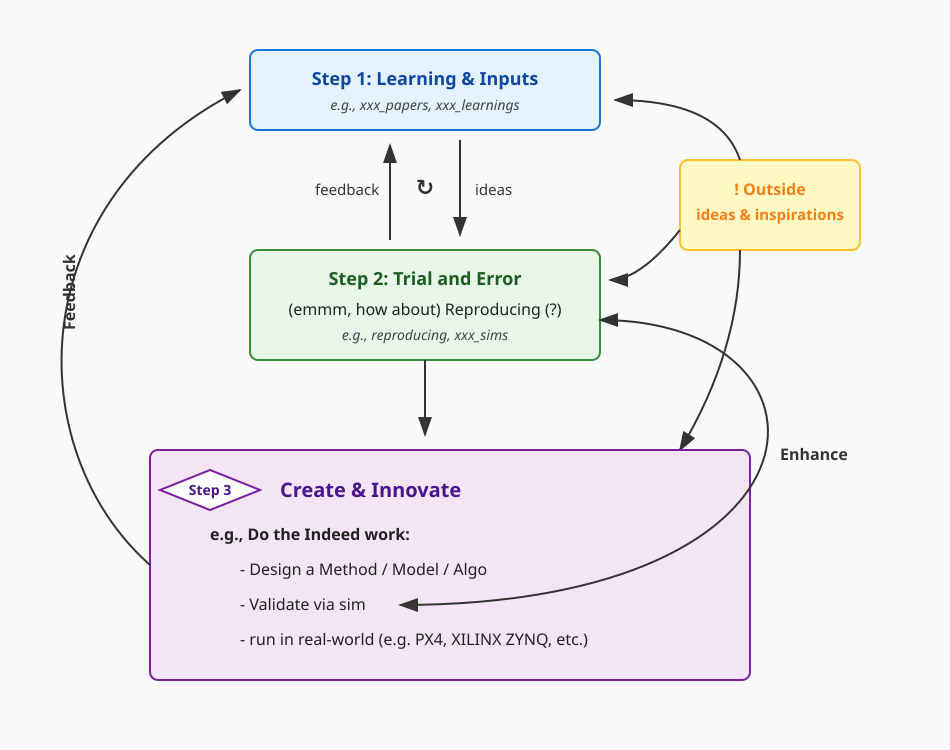
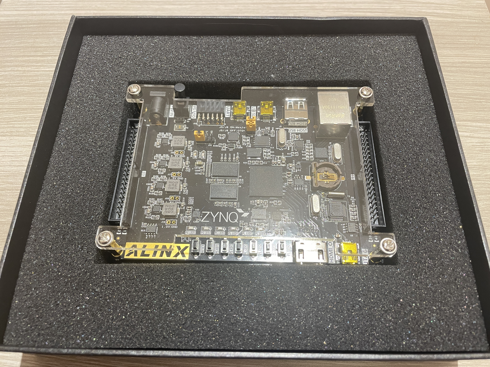
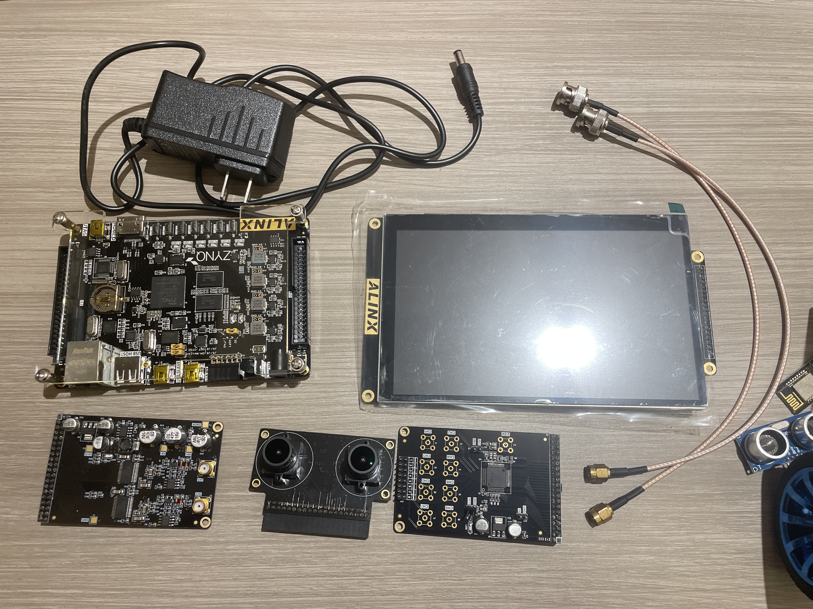
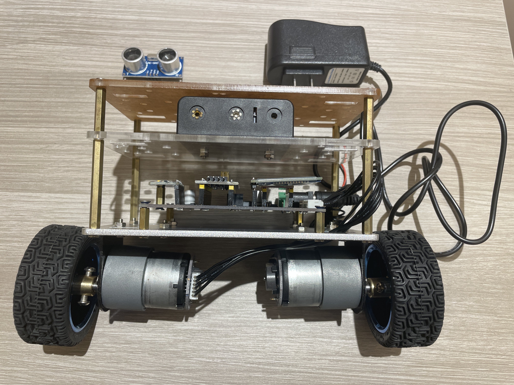
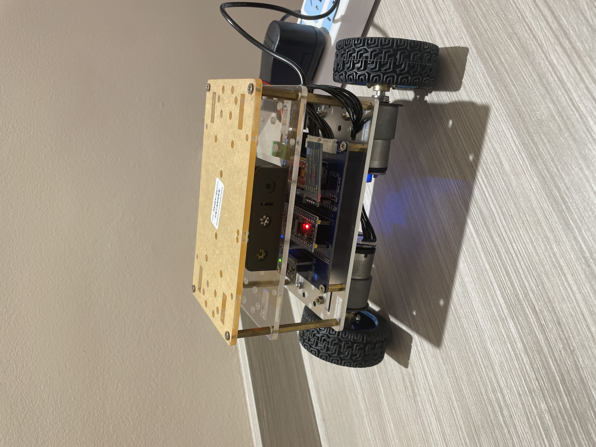

## Intro.
### Profile Card: *Twin-Card ARigi* (Beta) 😋

Expand to view Profile Card

- To access the links in the card, please _click_ 🖱️✨ the pic _below_ 👇 to enter the complete profile card[^note] page.

### An Interesting Fact about Me[^2] ⚽️🏟️
- A dedicated *Argentina national football team (selección Argentina de Fútbol)* 🇦🇷⚽️ fan since [*2006*](https://en.wikipedia.org/wiki/2006_FIFA_World_Cup) (huge fan of *Hernán Crespo* and *Ángel Di María*); a tea enthusiast with a particular palate for [*Longjing*](https://en.wikipedia.org/wiki/Longjing_tea) and [*Nihon-cha*](https://en.wikipedia.org/wiki/Tea_culture_in_Japan) (a.k.a. Japanese Green Tea) 🍵.

## News[^3]

Expand to see the newly released OSS in the past half year

  - 2026/03/11: [robo_sim](https://github.com/nicewang/robo_sim)
    - include uav_sim 👇
  - 2026/03/08: [uav_sim](https://github.com/nicewang/uav_sim)
  - 2026/03/08: [robotics_papers](https://github.com/nicewang/robotics_papers)
  

## What I am doing on Github?

Typically, a close-loop of research & exploration on topics that interest me most:

Examples

  - e.g.s of `Step 1: Input & Learning (Stage 1)`: [robo_paper (2019-2023)](https://nicewang.github.io/niceproject/learning/robotics/), [robo_paper (2021-present)](https://nicewang.github.io/robotics_papers/), TBDs
  - e.g.s of `Step 2: Trial and Error (Stage 2)`: [uav_sim](https://github.com/nicewang/uav_sim), [robo_sim](https://github.com/nicewang/robo_sim), [path_planning](https://github.com/nicewang/robot_path_planning), [mpc](https://github.com/nicewang/model_predictive_control), reproduction (to be released), TBDs
  - e.g.s of `Step 3: Create & Innovate (Stage 3)`: PX4-based, FPGA-ZYNQ-based, etc.

Nice's Mini Lab (with Real-World Sys.)

  - Current HW Platforms:
    - XILINX ZYNQ Suite
      - 
      - 
    - UGV (STM32 based)
      - 
      - 
  - Under Consideration:
    - RaspberryPi PX4 Quadrotor

## Milestones

Robo

  
  - Draft (to be organized)
    - [x] [hybrid uav sample essay (pid)](https://github.com/nicewang/uav_sim/tree/main/gym-pybullet-drones/case-1-waypoint)
    - [ ] [hybrid uav mpc](https://github.com/nicewang/uav_sim/tree/main/gym-pybullet-drones/case-1-waypoint/case-1-mpc)
    - [ ] transfer to stm32 based ugv
    - [ ] Ideas: CLF, Normalizing Flow, etc. reproducing
    - [ ] etc.
  

FPGA (zynq based)

  
  - Draft (to be organized)
    - [ ] CNN demo on zynq 7020
    - [ ] etc.
  

## License
The files and designs are licensed under a [CC-BY-4.0 license](http://creativecommons.org/licenses/by/4.0/).

[^note]: i.e. *Twin-Card BLaguna Beach*
[^2]: Whether this part shows up depends on my vibe.
[^3]: Sorted according to "first-in, first-out (FIFO)" "desc." order, within the past half year.
